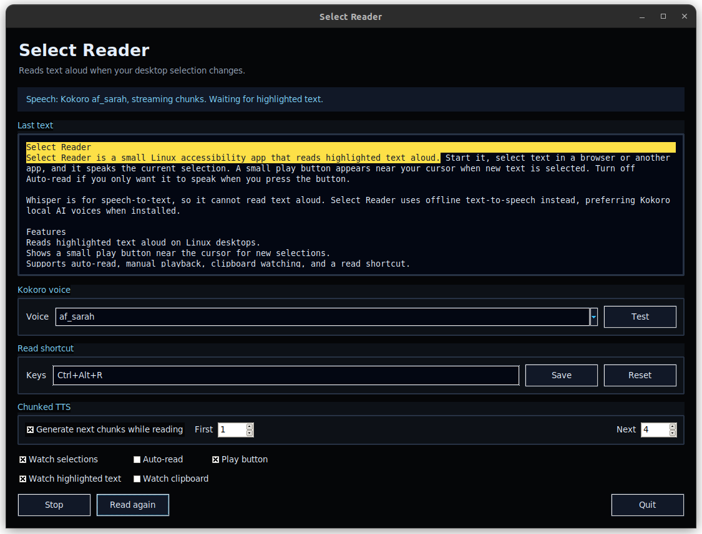

# Select Reader



Select Reader is a small Linux accessibility app that reads highlighted text
aloud. Start it, select text in a browser or another app, and it speaks the
current selection. A small play button appears near your cursor when new text is
selected. Turn off **Auto-read** if you only want it to speak when you press the
button.

Whisper is for speech-to-text, so it cannot read text aloud. Select Reader uses
offline text-to-speech instead, preferring Kokoro local AI voices when installed.

## Quick Start

Get started with Select Reader in 3 simple steps:

### 1. Install Dependencies & App
Run the following commands in your terminal to install system requirements and set up the app:

```sh
# Install tkinter and fallback TTS
sudo apt install python3-tk speech-dispatcher

# Install Select Reader
chmod +x install.sh
./install.sh
```

### 2. Configure Your Shortcut
Add a global keyboard shortcut to read text instantly from *any* application (PDF readers, browsers, text editors):
1. Open Ubuntu **Settings** -> **Keyboard** -> **View and Customize Shortcuts** -> **Custom Shortcuts** (at the bottom).
2. Click the **`+`** (Add Shortcut) button and enter:
   - **Name**: `Read Selection`
   - **Command**: `select-reader --read`
   - **Shortcut**: Press the keys you want to use (e.g., `Super+S` or `Ctrl+Alt+S`).

### 3. Start Reading!
- Open **Select Reader** from your app launcher or run `select-reader`.
- Highlight any text on your screen and press your global shortcut (or the default app shortcut `Ctrl+Shift+C`). 
- The app will restore, focus, and read the selected text aloud immediately.

## Features

- Reads highlighted text aloud on Linux desktops.
- Shows a small play button near the cursor for new selections.
- Supports auto-read, manual playback, pause/resume, clipboard watching, and a read shortcut.
- Uses Kokoro local AI voices when available, with offline speech fallbacks.
- Splits long selections into chunks for faster playback.

## Requirements

- Python 3 with Tkinter
- Kokoro for local AI voices, or one fallback speech command:
  - `spd-say` from `speech-dispatcher`
  - `espeak-ng`
  - `espeak`

On Debian or Ubuntu:

```sh
sudo apt install python3-tk speech-dispatcher
```

or:

```sh
sudo apt install python3-tk espeak-ng
```

For Kokoro local AI voices:

```sh
python3 -m pip install --user kokoro soundfile
sudo apt install espeak-ng
```

The **Kokoro voice** selector in the app lets you choose voices such as
`af_heart`, `af_bella`, `am_adam`, and `bf_emma`. You can set the default voice
when launching:

```sh
SELECT_READER_KOKORO_VOICE=af_bella python3 select-reader.py
```

## Keyboard Shortcuts

The default shortcut is `Ctrl+Shift+C` to read the current selection.

This works whenever the Select Reader window is focused. For a global shortcut
on X11, install the optional hotkey dependency:

```sh
python3 -m pip install --user pynput
```

Change the shortcut in the **Read shortcut** field inside the app. Shortcuts use
one key plus optional modifiers such as `Ctrl`, `Alt`, `Shift`, or `Super`.
Examples:

- `Ctrl+Shift+C`
- `Ctrl+Shift+Space`
- `Alt+F8`

Settings are saved in `~/.config/select-reader/config.json`.

## Chunked TTS

For long selections, enable **Generate next chunks while reading**. The first
chunk starts quickly with a small number of sentences, then later chunks are
generated while the current audio is playing.

- **First**: sentences in the first fast-start chunk
- **Next**: sentences in each following chunk

Optional helpers for selection access on some desktops:

```sh
sudo apt install wl-clipboard xclip xsel
```

## Run

```sh
python3 select-reader.py
```

## Install For Your User

```sh
chmod +x install.sh
./install.sh
```

After installing, open **Select Reader** from your app launcher or run:

```sh
select-reader
```

## Notes About Wayland

On X11, Linux exposes highlighted text through the primary selection, so the app
can read text just by selecting it.

On Wayland, many desktops intentionally prevent apps from reading highlighted
text from other apps. If selection reading does not work, enable **Watch
clipboard** in Select Reader, then copy selected text with `Ctrl+C` to read it.
Alternatively, map a system-wide custom shortcut (explained below) to trigger reading.

## Command Line Interface (CLI)

Select Reader runs a single-instance listener. Running CLI commands will communicate with the already-running application instance and automatically restore and focus the GUI window:

```sh
# Read the current highlighted text or clipboard selection immediately
select-reader --read

# Read specific text
select-reader --text "Hello world"

# Stop speech playback
select-reader --stop
```

## System-Wide Keyboard Shortcuts (Universal / Wayland)

On Wayland (or if you prefer a global hotkey without Python dependencies), you can bind a system shortcut to read highlighted text inside any application:

1. Open your desktop's keyboard settings (e.g., Ubuntu **Settings** -> **Keyboard** -> **Custom Shortcuts**).
2. Create a new custom shortcut:
   - **Name**: `Read Selection with Select Reader`
   - **Command**: `select-reader --read`
   - **Shortcut**: E.g., `Super+S` (Windows/Super Key + S)
3. Select any text, press the shortcut, and the reader will automatically pop up, focus, and read it.

## Browser Right-Click Menu Integration

Select Reader runs a local HTTP server listening on `127.0.0.1:4040` to trigger reading from browser context menus:

1. Install a browser extension that supports adding custom context menu search URLs, such as **Selection Search** (available for Chrome/Brave/Edge and Firefox).
2. Add a custom engine in the extension's settings:
   - **Name**: `Select Reader`
   - **URL**: `http://localhost:4040/read?text=%s`
3. Now, highlight any text, right-click, and choose **Select Reader** to speak it!
